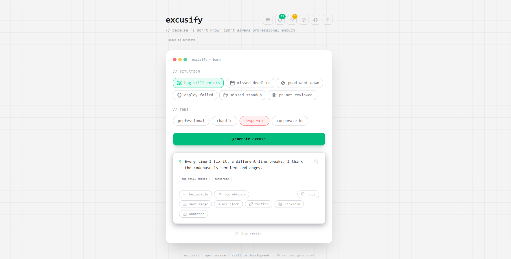

# <a href="https://excusify.vercel.app" target="_blank">Excusify - Developer Excuse Generator</a>

> Because "I don't know" isn't always professional enough.

<p align="left">
  
  
  
  
  <a href="https://github.com/byllzz">
    
  </a>
  
  
</p>

<br />

[](https://excusify.vercel.app)



⭐ Star it on GitHub if it saved your standup - you know it did.

---

## What is Excusify?

Excusify is a dev-focused tool that generates context-aware excuses for common engineering situations - missed deadlines, production outages, unreviewed PRs, failed deploys, and more.

Pick your situation, pick your tone, get an excuse. Copy it. Send it. Survive the standup.

Whether you need a polished corporate response for your PM, a chaotic one-liner for your tech lead, or a desperate plea for your team - Excusify has you covered. It also hooks into the Claude API so you can type in any custom situation and get a freshly generated, believable excuse on the spot.

---

## Features

✔️ **6 built-in situations** - bug still exists, missed deadline, prod went down, PR not reviewed, deploy failed, missed standup<br>
✔️ **4 tones** - professional, chaotic, desperate, corporate bs<br>
✔️ **Excuse of the day** - seed-based daily excuse, same for everyone on the same date<br>

Sharing & social<br>
✔️ **Share as image** - download a tweet-ready PNG card via `html2canvas` (improved templates)<br>
✔️ **Twitter & LinkedIn** - one-click share actions that open the native share compose<br>
✔️ **Slack & WhatsApp** - pre-formatted deep links for quick sharing<br>
✔️ **Copy as Slack block** - paste-ready bold + quoted format<br>
✔️ **Shareable URL** - unique link per excuse encoded in URL params<br>

Persistence & discovery<br>
✔️ **Favorites** - star and save your best excuses, persisted to `localStorage`<br>
✔️ **Excuse history** - shows the latest 10 by default with a "show all" toggle; history capped to avoid localStorage bloat<br>
✔️ **All-time counter** - tracks total excuses generated<br>

UX, accessibility & productivity<br>
✔️ **Settings panel** - slide-in drawer; active tab persisted (but transient open state is not)<br>
✔️ **Dark / Light mode** - full theme toggle, persisted across reloads<br>
✔️ **localStorage toggle** - opt in or out of data persistence<br>
✔️ **Auto-copy** - copies excuse to clipboard automatically on generate<br>
✔️ **Sound effects** - subtle synthesized audio feedback via Web Audio API<br>
✔️ **Keyboard shortcuts & help overlay** - `Space` generate, `?` show keyboard help, `S`/`T` focus pickers, `C` copy, `F` favorite<br>

Developer & repo<br>
✔️ **Repo tab** - view GitHub metadata, open issues, and top contributors inside the app; `RepoTab` reads `package.json` (`repository.url`) or a custom `excusify.repo` field


---

## Tech Stack

- [**React**](https://react.dev/) + [**Vite**](https://vitejs.dev/) - component architecture and build tooling
- [**Tailwind CSS**](https://tailwindcss.com/) - utility-first styling, dark/light theme
- [**html2canvas**](https://html2canvas.hertzen.com/) - DOM-to-PNG image export for share cards
- [**Web Audio API**](https://developer.mozilla.org/en-US/docs/Web/API/Web_Audio_API) - synthesized sound effects, no external files
- [**Vercel**](https://vercel.com) - deployment and hosting

---

## Project Structure

```
excusify/
├── public/
│   ├── favicon.svg
│   ├── favicon.png
│   ├── apple-touch-icon.png
│   └── og-image.png
├── src/
│   ├── components/
│   │   ├── SituationPicker.jsx   # situation selector buttons
│   │   ├── TonePicker.jsx        # tone selector pills
│   │   ├── ExcuseCard.jsx        # excuse output with all share actions
│   │   ├── ShareCard.jsx         # hidden card captured by html2canvas
│   │   ├── EotdBanner.jsx        # excuse of the day strip
│   │   └── SettingsPanel.jsx     # slide-in settings drawer
│   ├── data/
│   │   ├── excuses.js            # all 72 built-in excuses
│   │   ├── situations.js         # situation list with icons
│   │   └── tones.js              # tone list with ids
│   ├── App.jsx                   # root component, all state lives here
│   ├── main.jsx
│   └── index.css
├── index.html
├── package.json
├── vite.config.js
├── tailwind.config.js
└── README.md
```

---

## Getting Started

```bash
# clone the repo
git clone https://github.com/byllzz/excusify.git
cd excusify

# install dependencies
npm install

# run locally
npm run dev

# build for production
npm run build
```

---

## Usage

- Pick a **situation** from the selector - 6 built-in options covering the most common dev scenarios
- Pick a **tone** - professional, chaotic, desperate, or corporate bs
- Hit **generate excuse** or press `Space` to generate
- **Copy**, **share**, **rate**, or **star** the excuse from the card
- Use the **custom situation** input below the card - type any situation and get an AI-generated excuse
- Check the **Excuse of the Day** banner for today's featured excuse (changes daily for everyone)
- Click the **⚙ settings** icon to configure theme, sound, storage, auto-copy, and shortcuts
- Share via the **shareable URL** - every generated excuse gets its own link in the address bar

---

## Settings

| Setting | Description |
|---|---|
| **Theme** | Toggle dark / light mode across the entire app |
| **localStorage** | Persist your selections, excuse, and count across reloads |
| **Auto-copy** | Automatically copy excuse to clipboard on generate |
| **Keyboard shortcut** | Enable `Space` to trigger generate |
| **Sound effects** | Subtle synthesized pop on generate |
| **Excuse history** | View and clear your last 10 generated excuses |
| **Favorites** | View and clear your starred excuses |
| **Clear all data** | Wipe all saved state from localStorage |

---

## Contributing

Got a better excuse? Found a tone that's missing? Open a PR.

```bash
# 1. fork the repo
# 2. create your branch
git checkout -b feat/your-feature

# 3. make your changes
# 4. commit
git commit -m "feat: add your feature"

# 5. push and open a PR
git push origin feat/your-feature
```

**Ways to contribute:**

- Add new situations to `src/data/situations.js` and `src/data/excuses.js`
- Add new tones - follow the existing pattern in `tones.js` and `excuses.js`
 - Improve custom templates for generated excuses
- Fix bugs - open an issue first so we can discuss
- Improve accessibility - ARIA labels, focus management, keyboard nav
- Translate excuses - open a PR with a new locale file

**Please keep PRs focused** - one feature or fix per PR. If you're unsure whether something fits, open an issue first.

---


# License 📄

This project is licensed under the MIT License - see the [LICENSE.md](./LICENSE) file for details.
# Feedback

*Please contact me at **bilalmlkdev@gmail.com**. if you have any feedback or suggestions. :star: Star it, if you like it!*
